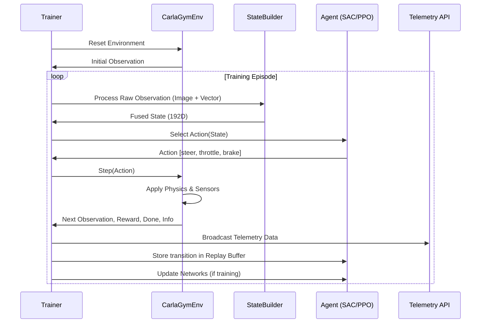

# 2. Sequence Diagram

```mermaid
sequenceDiagram
    participant T as Trainer
    participant E as CarlaGymEnv
    participant S as StateBuilder
    participant A as Agent (SAC/PPO)
    participant API as Telemetry API

    T->>E: Reset Environment
    E->>T: Initial Observation
    
    loop Training Episode
        T->>S: Process Raw Observation (Image + Vector)
        S->>T: Fused State (192D)
        T->>A: Select Action(State)
        A->>T: Action [steer, throttle, brake]
        T->>E: Step(Action)
        E->>E: Apply Physics & Sensors
        E->>T: Next Observation, Reward, Done, Info
        T->>API: Broadcast Telemetry Data
        T->>A: Store transition in Replay Buffer
        T->>A: Update Networks (if training)
    end
```
