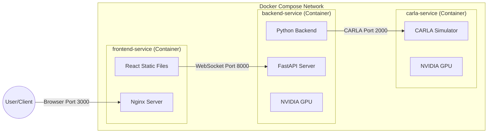

# 3. Deployment Diagram

```mermaid
graph LR
    subgraph "Docker Compose Network"
        subgraph "carla-service (Container)"
            CARLA_Bin[CARLA Simulator]
            GPU1[NVIDIA GPU]
        end

        subgraph "backend-service (Container)"
            PyApp[Python Backend]
            FastAPI_Srv[FastAPI Server]
            GPU2[NVIDIA GPU]
        end

        subgraph "frontend-service (Container)"
            ReactApp[React Static Files]
            Nginx[Nginx Server]
        end
    end

    User((User/Client)) -->|Browser Port 3000| Nginx
    ReactApp -->|WebSocket Port 8000| FastAPI_Srv
    PyApp -->|CARLA Port 2000| CARLA_Bin
```
